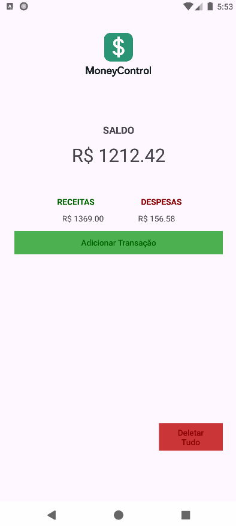
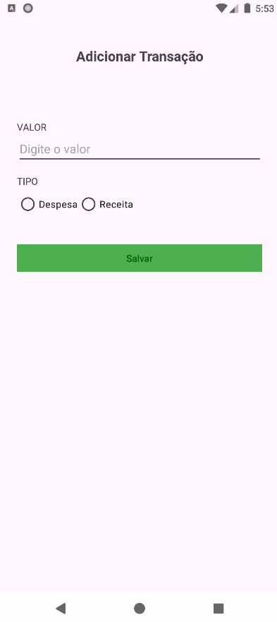

# 💰 MoneyControl

Aplicativo Android para controle de receitas e despesas pessoais.

## 📱 Funcionalidades
- Adicionar transações (Receita ou Despesa)
- Calcular e exibir saldo total
- Armazenamento com Room (SQLite)
- Design simples e direto
- Deletar todas as transações com um botão

## 🛠️ Tecnologias usadas
- Java
- Android SDK
- Room (Persistência de dados)
- XML (layouts)
- Material Design

## 📸 Screenshots

| 🏠 Tela Principal | ➕ Tela de Adicionar Transação |
|----------------------------|-------------------------------|
|  |  |

# APK do app
https://drive.google.com/file/d/1RH6uIMRFcG_SmVjnc4B6b01HPvCHUP4v/view?usp=drivesdk


## 📂 Organização do Projeto

```bash
📦 app
 ┗ 📂 src
    ┗ 📂 main
       ┣ 📂 java/com/example/moneycontrol
       ┃  ┣ 📄 MainActivity.java
       ┃  ┣ 📄 AddTransacoes.java
       ┃  ┣ 📄 AppDatabase.java
       ┃  ┣ 📄 Transacao.java
       ┃  ┗ 📄 TransacaoDao.java
       ┗ 📂 res
          ┗ 📂 layout
             ┣ 📄 activity_main.xml
             ┣ 📄 activity_splash_moneycontrol.xml
             ┗ 📄 activity_add_transacoes.xml
